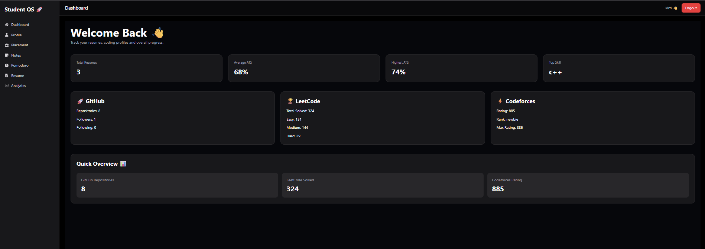
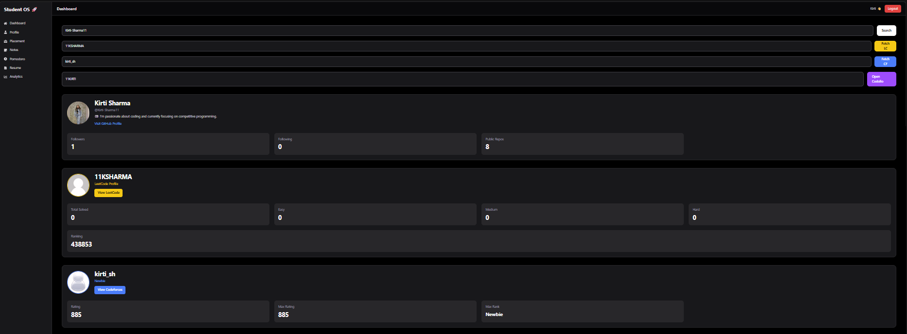
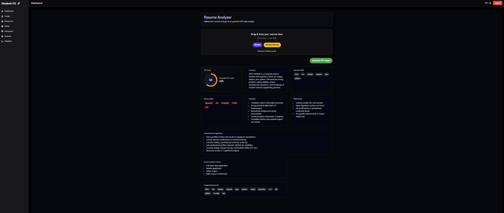
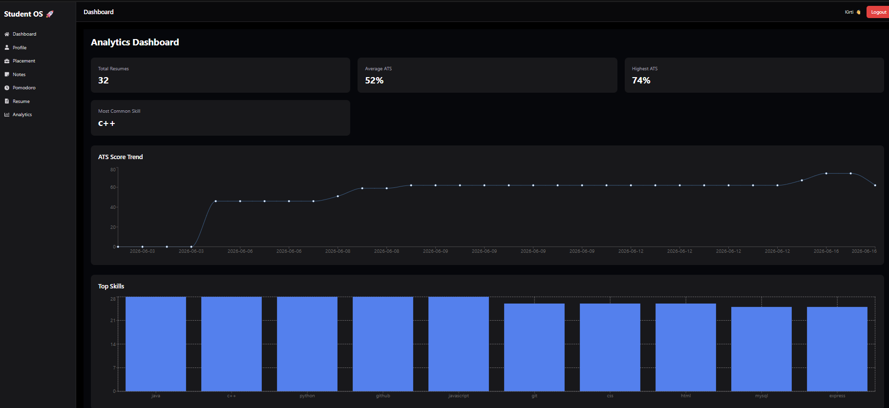
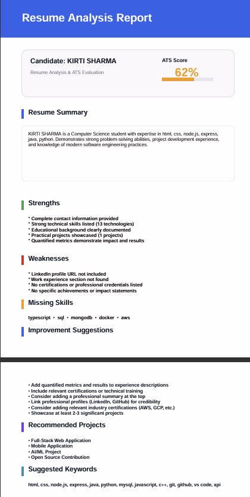

# 🚀 Student Productivity OS

A production-level MERN Stack platform built to help students manage productivity, improve coding profiles, analyze resumes, and track placement preparation through a unified dashboard.

---

## ✨ Features

### 🔐 Authentication & Security

* JWT Authentication
* Secure Login & Registration
* Protected Routes
* Password Hashing
* Rate Limiting

### 👨‍💻 GitHub Developer Profile

* GitHub Profile Integration
* Repository Statistics
* Followers & Following Insights
* Developer Dashboard

### 🏆 LeetCode Analytics

* LeetCode Profile Tracking
* Solved Problems Statistics
* Coding Activity Insights

### 📄 ATS Resume Analyzer

* PDF & DOCX Resume Upload
* OCR Fallback Support
* ATS Score Calculation
* Resume Summary Generation
* Skills Extraction
* Strengths & Weaknesses Detection
* Missing Skills Analysis
* Improvement Suggestions
* Downloadable PDF Reports

### 📊 Analytics Dashboard

* Total Resume Analyses
* Average ATS Score
* Highest ATS Score
* ATS Score Trends
* Skills Distribution Analytics

### 🎯 Placement Tracker

* Placement Preparation Monitoring
* Progress Tracking
* Student Performance Insights

### ⏱ Productivity Tools

* Pomodoro Timer
* Focus Sessions
* Productivity Tracking

---

## 🛠 Tech Stack

### Frontend

* React.js
* TypeScript
* Tailwind CSS
* React Router DOM
* Axios
* Recharts

### Backend

* Node.js
* Express.js
* MongoDB Atlas
* JWT Authentication
* Multer
* PDFKit

### APIs & Integrations

* GitHub API
* LeetCode API

---

## 📂 Project Structure

```bash
student-os/
│
├── frontend/
│   ├── src/
│   ├── pages/
│   ├── components/
│   └── services/
│
├── backend/
│   ├── src/
│   │   ├── controllers/
│   │   ├── routes/
│   │   ├── models/
│   │   ├── middleware/
│   │   └── utils/
│   │
│   └── uploads/
│
└── README.md
```

---

## 📸 Screenshots

### Dashboard


### profile


### Resume Analyzer


### Analytics Dashboard



### PDF Report



---

## ⚙ Installation

### Clone Repository

```bash
git clone https://github.com/your-username/student-os.git
cd student-os
```

### Install Frontend Dependencies

```bash
cd frontend
npm install
npm run dev
```

### Install Backend Dependencies

```bash
cd backend
npm install
npm run dev
```

---

## 🔑 Environment Variables

Create a `.env` file inside the backend folder:

```env
PORT=5000

MONGO_URI=your_mongodb_connection_string

JWT_SECRET=your_jwt_secret
```

---

## 🚀 Key Highlights

* Full Stack MERN Application
* REST API Architecture
* JWT Based Authentication
* Resume Parsing & ATS Analysis
* PDF Report Generation
* Analytics Dashboard with Charts
* GitHub & LeetCode Integration
* Production-Level Folder Structure

---

## 🎓 Learning Outcomes

Through this project, I gained hands-on experience with:

* React & TypeScript
* Express.js & REST APIs
* MongoDB Aggregation Pipelines
* JWT Authentication
* File Upload Handling with Multer
* PDF Generation using PDFKit
* Data Visualization with Recharts
* Third-Party API Integrations

---

## 👨‍💻 Author

**Kirti Sharma**

B.Tech Computer Science Engineering
National Institute of Technology Kurukshetra (NIT Kurukshetra)

---

⭐ If you found this project useful, consider giving it a star.
